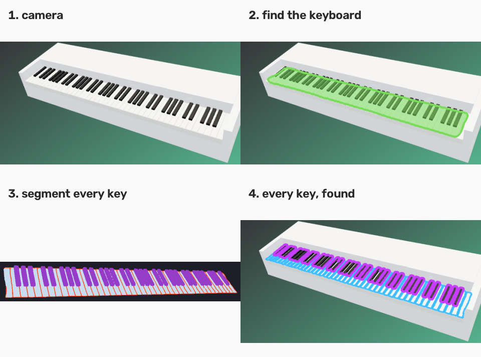

# pianoCV

Point a webcam at a piano and pianoCV finds every key, live, right in your browser.

**[Try it here](https://matheusfillipe.github.io/pianoCV/)**. Nothing gets uploaded: the
camera never leaves your machine.

Plug in a MIDI keyboard and the keys you play light up where they really are in the picture.
The idea is to draw visuals onto a real piano, like a video filter.

## How it works

A piano segmentation model looks at the camera and marks which pixels are white keys, black
keys, and the gaps between them. Two smaller models help it: one finds roughly where the
keyboard is, and one reads the edges of the keys. Then a bit of geometry fits a real keyboard
layout on top, so every key is found, even the blurry ones far away, and each one gets a
note.



The models run in the browser with [ONNX Runtime Web](https://onnxruntime.ai/docs/tutorials/web/),
on your GPU through [WebGPU](https://developer.mozilla.org/docs/Web/API/WebGPU_API) when it can.
They were trained with [PyTorch](https://pytorch.org) on thousands of fake pianos rendered in
[three.js](https://threejs.org), and they live on
[Hugging Face](https://huggingface.co/mattf/pianoCV). Your hands are found with
[MediaPipe](https://ai.google.dev/edge/mediapipe) so the glow stays behind them, and the
notes come in through [Web MIDI](https://developer.mozilla.org/docs/Web/API/Web_MIDI_API).

## Run it yourself

You need [Bun](https://bun.sh) and [uv](https://docs.astral.sh/uv/).

```
make install
make model
make dev
```

Then open http://localhost:5273/ and allow the camera. `make help` shows everything else,
including how to render training pianos and train the models.

## Licence

Apache 2.0.
